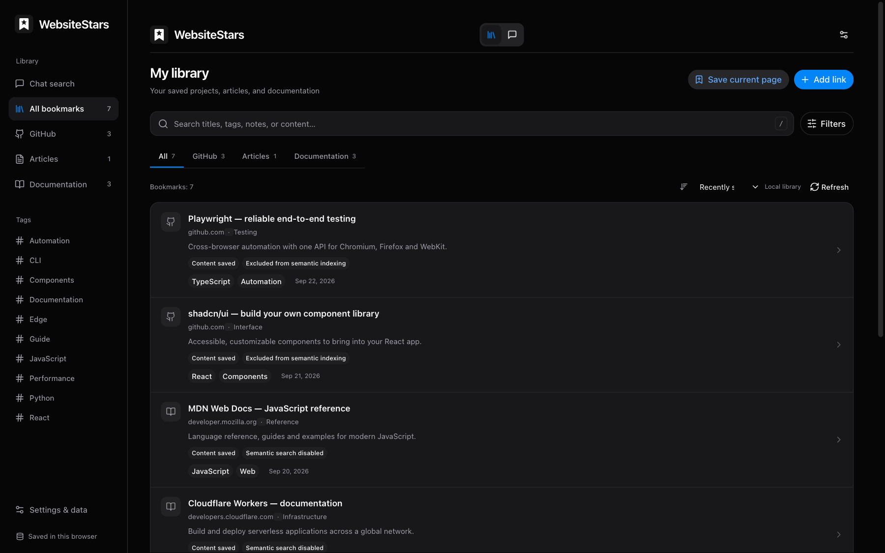
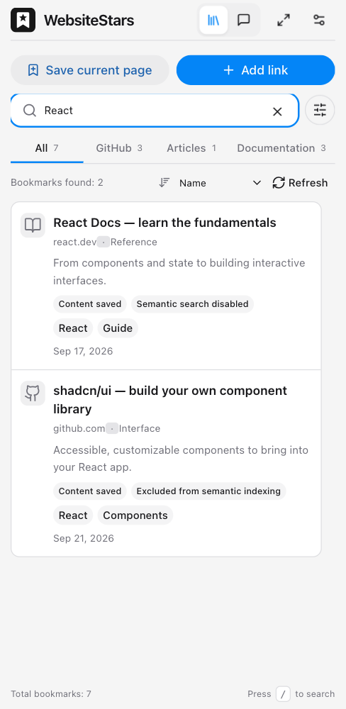

<h1 align="center"> WebsiteStars</h1>

---

<p align="center">
  
  <a href="https://www.google.com/chrome/"></a>
  
</p>

<p align="center"><strong>English</strong> · <a href="README.zh-CN.md">简体中文</a></p>

<p align="center">
  <strong>Save what matters. Find it when you need it.</strong><br>
  Collect GitHub repositories, articles, and docs while you browse.<br>
  Search your local library, or optionally ask AI questions grounded in your saved sources.
</p>

<h3 align="center"><a href="#installation">Install WebsiteStars →</a></h3>



<p align="center"><sub>Actual extension UI with an illustrative local collection. AI features are off by default.</sub></p>

<p align="center"><a href="#features">Features</a> · <a href="#installation">Installation</a> · <a href="#optional-ai-and-semantic-search">AI setup</a> · <a href="#development">Development</a> · <a href="#contributing">Contributing</a></p>

## In use

<p align="center"></p>

<p align="center"><sub>Search your saved sources directly in the sidebar, without leaving the current page.</sub></p>

## Features

- **Save from where you browse.** A button beside GitHub's Star button, a draggable webpage save button, a context menu, and keyboard shortcuts. Opening the sidebar does not save a page or change GitHub stars.
- **Keep a local library.** Store links, extracted article text, GitHub metadata, and README snapshots in your browser. Edit titles, descriptions, tags, categories, and private notes.
- **Search and filter quickly.** Keyword search supports Chinese and technical terms, with filters for source, tags, categories, and programming language.
- **Ask for what you remember.** Optional conversational search can refine a vague description, inspect saved sources, compare results, and return only its final selected bookmarks as clickable cards.
- **Use hybrid retrieval.** An optional, separately configured embedding service adds multilingual semantic search to keyword retrieval. Source chunks and vectors are indexed incrementally.
- **Read comfortably.** Full library and sidebar views, system light/dark themes, responsive layouts, Markdown rendering, and English/Chinese interfaces that follow the browser's language preferences.
- **Back up your collection.** Export JSON and preview imports before merging. Existing entries are preserved when duplicates are found.

## Installation

Requires **Chrome 120+**. WebsiteStars is not currently distributed through the Chrome Web Store.

### From a GitHub Release

1. Download `websitestars-<version>-chrome.zip` from [Releases](https://github.com/m2eat/WebsiteStars/releases), when available.
2. Extract the ZIP into a permanent folder.
3. Open `chrome://extensions` and enable **Developer mode**.
4. Choose **Load unpacked** and select the extracted folder containing `manifest.json`.
5. Pin WebsiteStars to the toolbar. Click its icon to open the sidebar.

GitHub releases do not install browser updates automatically. Replace the unpacked extension's files and reload it to update; avoid uninstalling if you want to keep local data.

### From source

Requires **Node.js 22+** and npm.

```sh
git clone https://github.com/m2eat/WebsiteStars.git
cd WebsiteStars
npm ci
npm run build
```

Load `.output/chrome-mv3` as an unpacked extension using the steps above.

## Usage

1. Save a webpage or public GitHub repository using its save button, the context menu, or **Save current page** in the sidebar.
2. Open the full library to search, filter, read saved content, and edit notes.
3. Use **Refresh** to reload local library data; it does not capture the current page or call AI.
4. Export a JSON backup from **Settings & data** before moving browsers or uninstalling.

On GitHub repository pages (including the newer header layout), **Save to WebsiteStars** appears beside GitHub's **Star** control. Saving to WebsiteStars does not star the repository on GitHub; the two actions are independent.

| Default shortcut | Action |
| --- | --- |
| `Alt+Shift+S` | Open the library |
| `Alt+Shift+D` | Save the current page |

Change shortcuts at `chrome://extensions/shortcuts`. Manual URL entry saves the link and supplied fields; visit and save the original webpage to capture its body. Public GitHub repositories can fetch metadata and README content separately.

### Languages

English and Simplified Chinese are included. The interface uses the browser's preferred language: Chinese locales use Simplified Chinese, and unsupported languages fall back to English. Change the browser language preference and reopen extension pages to apply it. Browser-managed extension labels use Chrome's native locale selection.

Saved titles, notes, source content, and existing conversations are never automatically translated. Renaming the project retains the existing database and settings identifiers, so existing local data remains available when reloading the same extension.

## Optional AI and semantic search

AI features are **off by default**. Basic saving, editing, and keyword search work without an AI account or a backend you need to host.

### Conversational search

1. In settings, configure an OpenAI-compatible Chat Completions endpoint or Cloudflare Workers AI, with your model and credentials.
2. Fetch the provider's model list or enter a model manually. Enable conversational search and save.
3. Test the Agent connection. The model must support streaming and standard `tools/tool_calls`.
4. Switch to chat and describe a resource, then refine with follow-ups such as “Only TypeScript” or “Compare those two.”

The Agent uses the Vercel AI SDK `ToolLoopAgent`. It retrieves candidates, reads evidence, and submits a selected result list. Cards reflect that final list, not every retrieved candidate. A failed or stopped query can be retried; interrupted requests are not automatically replayed.

Default timeouts are 180 seconds per model request and 900 seconds per query. Both are configurable. Automatic analysis of newly saved items is a separate opt-in feature.

### Semantic retrieval

Configure an embedding endpoint and model separately, then enable semantic search. A running local Ollama instance can use:

```text
Endpoint: http://127.0.0.1:11434/v1
Model:    qwen3-embedding:0.6b (or another installed embedding model)
API key:  leave empty for local Ollama
```

Ollama must allow the extension origin through `OLLAMA_ORIGINS`. On macOS, for the Ollama app:

```sh
launchctl setenv OLLAMA_ORIGINS "chrome-extension://*"
```

Quit and restart Ollama afterward. To allow only WebsiteStars, replace `*` with its extension ID from `chrome://extensions`. Run only one Ollama server on the configured port. WebsiteStars does not install Ollama or download models.

If vectors are unavailable, retrieval falls back to keyword search and reports the fallback. Rebuilding the index preserves saved resources and notes. Search quality depends on the saved content and configured models.

## Privacy and permissions

- Bookmarks, content, notes, conversations, and settings are stored locally. There is no built-in cloud sync.
- Enabled AI analysis sends source metadata and content to the configured provider. Chat sends your question, limited recent questions, and retrieved source excerpts. Semantic indexing sends eligible source content to the embedding service.
- Private notes, manual description/tag overrides, and separately saved selections are excluded from model requests. Text also present in a saved article may still appear in a source excerpt. Titles can include manual edits.
- Blocked domains and private or unverified GitHub repositories are excluded from model retrieval. Optional note-assisted search uses private fields locally only.
- Credentials are stored locally **without encryption** and are excluded from JSON backups. Backups contain notes and saved content, but not connection settings, API keys, conversations, or run history.
- HTTP(S) site access supports injected save controls. Content extraction is user initiated. `activeTab`, `scripting`, `storage`, `contextMenus`, `sidePanel`, `alarms`, and `offscreen` support capture, storage, background work, and model networking.
- Uninstalling the extension deletes its local data. Export backups regularly. Provider pricing and data policies apply when AI features are enabled.

## Development

```sh
npm ci
npm run dev              # WXT development mode
npm run typecheck
npm test
npm run build
npx playwright install chromium
npm run test:browser
npm run zip              # .output/websitestars-<version>-chrome.zip
```

On Linux, use `npx playwright install --with-deps chromium` to install browser system dependencies. Tests use isolated data and fixture services; optional live-model evaluations require an explicit environment variable and a running local model service.

**Stack:** WXT · React · TypeScript · HeroUI v3 · Tailwind CSS v4 · Dexie/IndexedDB · MiniSearch · Vercel AI SDK · Mozilla Readability. Chat components include adapted Beautiful UI source; see [third-party notices](THIRD_PARTY_NOTICES.md).

## CI and releases

Pushes and pull requests run type checking, unit/integration tests, package verification, and Chromium browser tests. Successful runs upload the extension ZIP and SHA-256 checksum. Pushing a `vX.Y.Z` tag matching the package version publishes the same tested archive to GitHub Releases after all checks pass.

See the [release guide](docs/releases.md) for versioning and recovery steps. Chrome Web Store publishing is not configured.

## Documentation

- [Agent query architecture](docs/agent-query.md) — implementation notes in Chinese
- [Retrieval design and evaluations](docs/retrieval-upgrade.md) — scope, evidence, and limitations
- [Release guide](docs/releases.md)
- [Internationalization](docs/i18n.md)
- [Requirements](docs/requirements.md)

## Contributing

Issues and pull requests are welcome at [m2eat/WebsiteStars](https://github.com/m2eat/WebsiteStars). For bug reports, include browser/extension versions, reproduction steps, and redacted logs. Keep credentials and private bookmarks out of reports.

Before submitting changes, run type checks and relevant tests. Verify user-facing changes in the browser, including the sidebar, full library, both languages, and narrow layouts where applicable. Keep both READMEs and translation catalogs consistent.

Cloud sync, bulk GitHub Stars import, private repository support, PDFs, Firefox, and browser-bundled embedding models are not currently implemented.

## License

A project license has not yet been selected. Third-party components retain their respective licenses; see [THIRD_PARTY_NOTICES.md](THIRD_PARTY_NOTICES.md).
