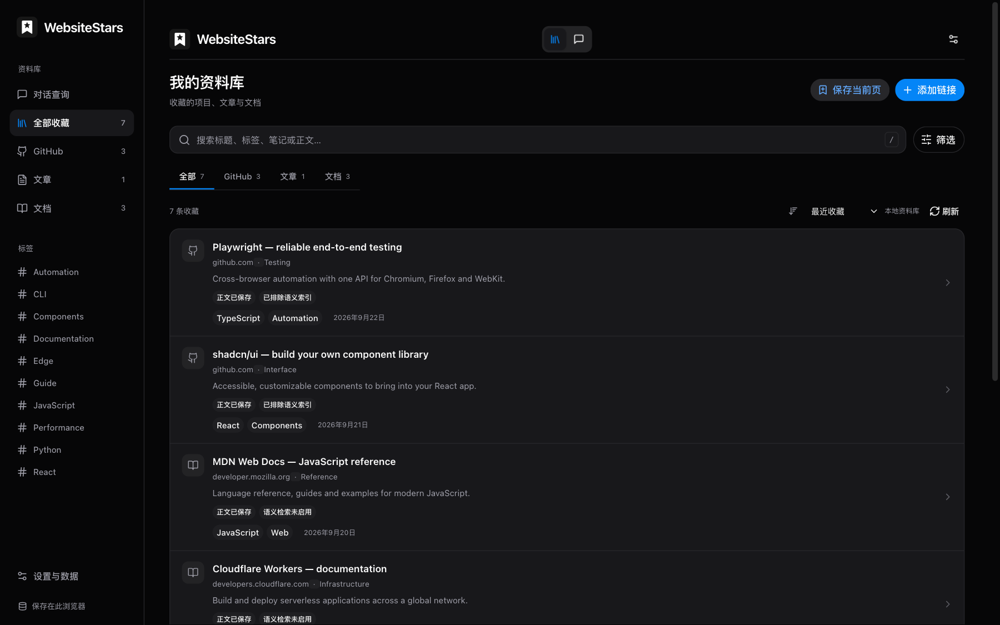
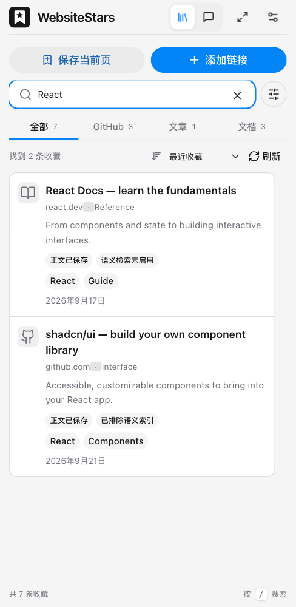

<h1 align="center"> WebsiteStars</h1>

---

<p align="center">
  
  <a href="https://www.google.com/chrome/"></a>
  
</p>

<p align="center"><a href="README.md">English</a> · <strong>简体中文</strong></p>

<p align="center">
  <strong>收藏有用的资源，需要时轻松找回。</strong><br>
  浏览时保存 GitHub 仓库、技术文章和文档。<br>
  在本地资料库中搜索，或按需用 AI 对话从已保存的来源中找答案。
</p>

<h3 align="center"><a href="#安装">安装 WebsiteStars →</a></h3>



<p align="center"><sub>真实扩展界面，使用示例收藏数据；AI 功能默认关闭。</sub></p>

<p align="center"><a href="#功能">功能</a> · <a href="#安装">安装</a> · <a href="#可选-ai-与语义检索">AI 配置</a> · <a href="#开发">开发</a> · <a href="#参与贡献">参与贡献</a></p>

## 使用场景

<p align="center"></p>

<p align="center"><sub>无需离开当前页面，就能在侧栏查找收藏的资料。</sub></p>

## 功能

- **随浏览收藏**：GitHub Star 旁按钮、可拖动的网页悬浮按钮、右键菜单和快捷键。打开侧栏不会自动收藏，也不会改变 GitHub Star 状态。
- **本地资料库**：保存链接、文章正文、GitHub 元信息和 README 快照，编辑标题、简介、标签、分类与私人笔记。
- **快速查找**：支持中文及技术词的关键词搜索，按来源、标签、分类和编程语言筛选。
- **描述记忆即可查询**：可选 Agent 对话可根据模糊用途查找、读取来源、比较候选，并只为最终选中的收藏展示可点击卡片。
- **混合检索**：单独配置的 Embedding 服务可加入多语言语义检索，来源分块和向量采用增量索引。
- **舒适阅读**：完整资料库和侧栏、系统明暗主题、自适应布局、Markdown 渲染，以及跟随浏览器语言偏好的中英文界面。
- **备份恢复**：导出 JSON，导入前校验与预览，合并时跳过重复条目并保留已有内容。

## 安装

需要 **Chrome 120+**。项目目前尚未上架 Chrome 扩展商店。

### 从 GitHub Release 安装

1. 在 [Releases](https://github.com/m2eat/WebsiteStars/releases) 中下载已发布的 `websitestars-<版本>-chrome.zip`。
2. 解压到固定目录。
3. 打开 `chrome://extensions`，启用「开发者模式」。
4. 点击「加载已解压的扩展程序」，选择包含 `manifest.json` 的解压目录。
5. 将 WebsiteStars 固定到工具栏，点击图标打开侧栏。

GitHub Release 不提供浏览器自动更新。更新时替换原目录文件并重新加载扩展；若要保留本地数据，请避免卸载扩展。

### 从源码安装

需要 **Node.js 22+** 和 npm。

```sh
git clone https://github.com/m2eat/WebsiteStars.git
cd WebsiteStars
npm ci
npm run build
```

按上述步骤加载项目中的 `.output/chrome-mv3` 目录。

## 使用

1. 使用页面收藏按钮、右键菜单或侧栏的「保存当前页」，收藏网页或公开 GitHub 仓库。
2. 打开完整资料库，搜索、筛选、阅读已保存内容并编辑笔记。
3. 「刷新」仅重新读取本地资料，不采集当前页、不调用 AI。
4. 更换浏览器或卸载之前，在「设置与数据」导出 JSON 备份。

| 默认快捷键 | 功能 |
| --- | --- |
| `Alt+Shift+S` | 打开资料库 |
| `Alt+Shift+D` | 收藏当前页面 |

可在 `chrome://extensions/shortcuts` 修改快捷键。手动输入普通网页 URL 只保存链接与填写的信息；访问原网页后再收藏可采集正文。公开 GitHub 仓库可单独获取元信息与 README。

### 界面语言

内置英文和简体中文。默认跟随浏览器首选语言：中文语言地区使用简体中文，未支持的语言回退到英文。修改浏览器语言偏好后，重新打开扩展页面即可生效。由浏览器管理的扩展名称和菜单描述使用 Chrome 原生语言选择机制。

收藏标题、笔记、来源正文和历史对话不会被自动翻译。项目改名后保留原数据库和设置标识，重新加载同一个扩展时仍可读取已有本地数据。

## 可选 AI 与语义检索

AI 功能**默认关闭**。基础收藏、编辑和关键词查找不需要 AI 账号，也不需要自行部署后端。

### 对话查询

1. 在设置中填写 OpenAI-compatible Chat Completions 服务或 Cloudflare Workers AI 的地址、模型及凭据。
2. 获取模型列表或手动填写模型，启用对话查询并保存。
3. 测试 Agent 连接；模型必须支持流式输出和标准 `tools/tool_calls`。
4. 切换到对话，描述记得的资源，再用“只看 TypeScript 的”“比较这两个”等追问缩小范围。

Agent 使用 Vercel AI SDK `ToolLoopAgent`，召回候选、核对来源后提交最终清单。卡片只展示最终选中的收藏，不展示全部检索候选。失败或停止的查询可重试；中断的请求不会自动重放。

单次模型请求默认超时 180 秒，整轮查询默认 900 秒，均可在设置中调整。新增收藏的自动 AI 分析是另一个独立开关。

### 语义检索

单独配置 Embedding 服务与模型后开启语义检索。已运行的本机 Ollama 可使用：

```text
服务地址：http://127.0.0.1:11434/v1
模型：    qwen3-embedding:0.6b（或其他已安装的向量模型）
API Key： 本机 Ollama 可留空
```

Ollama 需要通过 `OLLAMA_ORIGINS` 允许扩展来源。macOS Ollama 应用可执行：

```sh
launchctl setenv OLLAMA_ORIGINS "chrome-extension://*"
```

执行后彻底退出并重新打开 Ollama。若只允许 WebsiteStars，将 `*` 替换为 `chrome://extensions` 中的扩展 ID。同一端口只运行一个 Ollama 服务。扩展不会安装 Ollama 或自动下载模型。

向量暂不可用时会降级为关键词检索并提示。重建索引保留原收藏和笔记。实际检索效果取决于来源完整度和所配置的模型。

## 隐私与权限

- 收藏、正文、笔记、对话和设置保存在本机浏览器，没有内置云同步。
- 启用 AI 分析后，来源元信息和正文会发送至所配置的服务。对话发送问题、有限的近期问题及候选原文片段；语义索引将允许发送的来源内容交给 Embedding 服务。
- 私人笔记、人工简介/标签覆盖和单独保存的划词不进入模型请求；同样的文字若出现在正文中，仍可能作为正文片段发送。标题可能包含人工编辑内容。
- 禁止域名及私有或未确认公开的 GitHub 仓库不参与模型检索。可选的笔记辅助查找仅在本地使用私人字段。
- 凭据保存在本机且**未加密**，不进入 JSON 备份。备份包含笔记和已保存正文，不包含连接设置、API Key、对话及运行记录。
- HTTP(S) 站点权限用于注入收藏入口；正文提取由用户操作触发。`activeTab`、`scripting`、`storage`、`contextMenus`、`sidePanel`、`alarms`、`offscreen` 分别支持采集、存储、菜单、侧栏、后台任务和模型网络请求。
- 卸载会删除扩展本地数据，请定期备份。开启 AI 后需遵循所用服务的价格和数据政策。

## 开发

```sh
npm ci
npm run dev              # WXT 开发模式
npm run typecheck
npm test
npm run build
npx playwright install chromium
npm run test:browser
npm run zip              # .output/websitestars-<版本>-chrome.zip
```

Linux 可使用 `npx playwright install --with-deps chromium` 安装浏览器系统依赖。测试使用隔离数据与测试服务；真实本机模型评测需要显式环境变量及已运行的模型服务。

**技术栈：** WXT · React · TypeScript · HeroUI v3 · Tailwind CSS v4 · Dexie/IndexedDB · MiniSearch · Vercel AI SDK · Mozilla Readability。聊天界面使用了适配后的 Beautiful UI 源码，见 [第三方声明](THIRD_PARTY_NOTICES.md)。

## CI 与发布

提交和 Pull Request 自动执行类型检查、单元/集成测试、包校验与 Chromium 浏览器测试。全部通过后上传 ZIP 和 SHA-256 校验文件。推送与项目版本一致的 `vX.Y.Z` 标签，会在检查通过后将同一份已测试安装包发布到 GitHub Releases。

版本更新和失败恢复步骤见 [发布指南](docs/releases.md)。尚未配置 Chrome 扩展商店自动发布。

## 文档

- [Agent 对话架构](docs/agent-query.md)
- [检索设计与评测](docs/retrieval-upgrade.md)
- [发布指南](docs/releases.md)
- [国际化说明](docs/i18n.md)
- [需求文档](docs/requirements.md)

## 参与贡献

欢迎在 [m2eat/WebsiteStars](https://github.com/m2eat/WebsiteStars) 提交 Issue 和 Pull Request。报告问题时请提供浏览器/扩展版本、复现步骤和脱敏日志，不要附上凭据或私人收藏。

提交前运行类型检查及相关测试。界面变更需要在浏览器中验证侧栏、完整资料库、中英文及相关窄屏布局，并同步维护两份 README 和翻译词典。

当前尚未实现云同步、GitHub Stars 批量导入、私有仓库、PDF、Firefox 和浏览器内置向量模型。

## 许可证

项目尚未选定许可证。第三方组件遵循各自许可证，详见 [THIRD_PARTY_NOTICES.md](THIRD_PARTY_NOTICES.md)。
