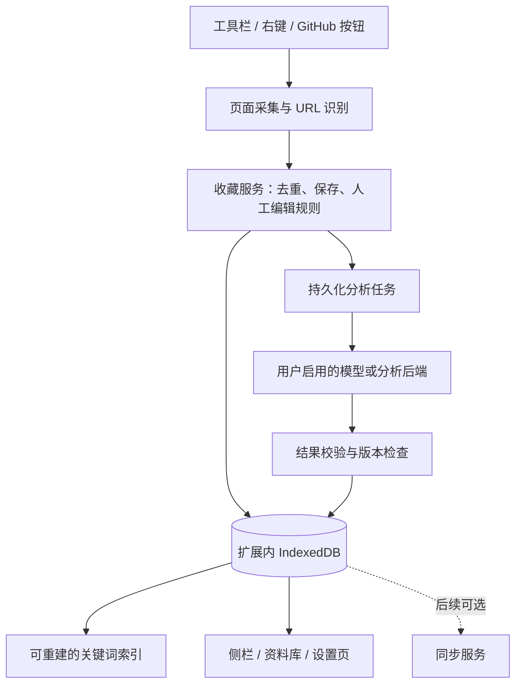

# Starts 需求深度分析与技术调研

- 调研日期：2026-09-22。
- 输入：[requirements.md](../requirements.md)。
- 性质：需求分析和技术建议；不是已经确认的产品决策，也不是已完成的实现。
- 方法：查阅 Chrome、GitHub、Cloudflare、Google 及相关开源项目的官方文档和源码仓库。价格、版本、条款以本次访问内容为准，发布前需再次核对。
- 调研开始时，当前工作区只发现需求文档，未发现可运行原型；本文不把需求第 10 节描述的原型能力当作已核验代码。
- 框架专项调研见：[extension-frameworks.md](extension-frameworks.md)。

## 1. 结论与产品定位

建议围绕“在浏览时保存，日后按能力找回”推进。技术上可以先交付无自建后端的 Chrome 扩展：本地保存与关键词检索完整运行，AI 在用户配置后单独启用，云同步不作为收藏前提。

推荐初始组合：**WXT + React + TypeScript + Dexie/IndexedDB + MiniSearch**。正文抽取以 Mozilla Readability 为基线，与 Defuddle 用真实技术网页比较；GitHub 仓库优先走官方 API；分析通过可替换的提供方适配器接入。这是基于需求匹配和文档调查的建议，尚未经过本项目原型实测。[1][2][9][10][11][12][13]

最需要先验证的三件事：

1. 收藏可靠性：关闭界面、网络失败、后台暂停都不能让“已保存”变成数据丢失。
2. 技术内容完整性：代码、限制条件和使用场景不能在提取或截断时消失。
3. 检索有效性：中文描述、英文项目名与技术术语能否一起工作。

### 1.1 与已有产品的差异

| 产品 | 官方资料确认的能力 | 对 Starts 的启示 |
|---|---|---|
| Karakeep | 自托管收藏、扩展入口、AI 标签与摘要、全文与语义检索、列表与内容归档 | “AI 书签”已是已有能力；仅此不足以形成清晰差异 |
| Linkwarden | 自托管书签、网页保存、阅读与批注、协作 | 网页永久归档和团队管理会显著扩大范围，首版不宜照搬 |
| Obsidian Web Clipper | 浏览器剪藏、高亮、模板、离线 Markdown 文件；官方源码采用 Defuddle | 可借鉴正文提取和可迁移性，Starts 则突出跨仓库与文章的统一检索 |

以上来自官方功能介绍，未进行竞品安装评测；没有据此断言竞品“不支持 GitHub”或搜索效果差。[24][25][26]

Starts 更具体的价值主张应是：**面向开发者，把仓库能力、文章中的方法和自己的收藏理由放在一起查找。** 因而 use_cases、运行环境、技术栈和私人笔记，比聊天界面更直接影响产品价值。

需求背景中“GitHub Stars 只保存链接和标题”的表述应修正。GitHub 官方已经提供 Stars 的搜索、排序、语言/类型筛选和列表整理；其官方说明的 Stars 搜索主要按仓库或 topic 名称查找。Starts 的增量应聚焦跨来源统一检索、私人收藏理由和从正文提取的能力信息，而非把已有的列表与筛选当作空白。[33]

## 2. 原需求中需要消除的歧义

| 位置 | 问题 | 建议明确的规则 |
|---|---|---|
| §5.6、§8、§9 | 设置模型被列入 P1，但首期验收要求能更换、关闭模型 | P0 保留 AI 开关、模型、凭证、端点或后端地址；提示词编辑和完整提供方矩阵后置 |
| §5.6 与 P0 | “全部必须可配”同时覆盖存储、向量、自定义字段、同步 | 区分最终能力与首版界面；首版只实现实际使用的适配器 |
| §4、§9 | 工具栏一键保存与点击弹窗搜索没有定义关系 | 明确工具栏默认动作，并给检索独立入口 |
| §5.2 | “任意 http(s) 页面”容易被理解为任意页面都能完整解析 | 在浏览器允许注入的页面提取；失败保留链接和可得元数据；受限页明确提示 |
| §5.3 | github 是来源，article/docs 是内容类型 | 内部建议分开 source 与 kind；UI 仍可显示仓库/文章/文档 |
| §5.4 | language 可能指代码语言或文章语言 | 明确编程语言筛选与内容语言分别是什么 |
| §5.4 | 混合列表按 stars 排序时文章没有数值 | 仅仓库视图开放 stars 排序，或明确空值靠后 |
| §5.5 | 展示“原文/README”，但正文是否保存仍待定 | 区分原始链接、抽取快照与完整网页归档 |
| §6 | 重新分析是否覆盖人工编辑未定义 | 人工摘要、分类和标签优先；AI 更新作为独立建议 |
| §7 | “默认私有”与第三方分析的关系不明确 | 本地存储、模型处理、云同步分别授权，说明发送哪些字段 |
| §8 | “大多数”“可用”不可量化 | 建立真实页面和查询样本，测抽取成功率、检索命中和失败恢复 |
| §10 | “保留 API”可能被误解成迁移后可直接复用 | 先审计模型耦合、鉴权、数据库依赖和失败处理，再决定复用程度 |

另需确定：Starts 是否为最终拼写；本工具收藏与 GitHub Star 是否独立；文档中的“免费优先”是零账单硬约束，还是允许用户选择付费服务。

## 3. 扩展框架选型

### 3.1 比较与推荐

| 选项 | 已核实的方向 | 对本项目的适配判断 |
|---|---|---|
| WXT | 基于 Vite 的构建、TypeScript、文件入口、React 等框架、侧栏/设置页/普通扩展页、内容脚本 UI 工具 | 首选：本项目有多个扩展运行环境和页面，需要统一工程组织 |
| Plasmo | React/TypeScript 优先，约定式入口，内容脚本 UI、消息/存储辅助、多浏览器构建与发布工具 | 可选：适合偏好 React 约定式开发的团队；消息和存储辅助不能代替业务一致性设计 |
| CRXJS + Vite | Vite 插件，React 等模板，popup/sidepanel 示例，内容脚本开发支持 | 可选：更贴近直接管理 manifest；适合希望少一层框架约定的团队 |
| 原生 Manifest V3 | 浏览器平台直接提供 API，构建与目录组织自行选择 | 可实现全部目标，但需要自行维护更多构建、重载、跨浏览器和入口配置 |

这是适配性判断，不是性能排名。框架专项研究与本报告都推荐 WXT，将 CRXJS 作为主要备选。专项报告核对到的发布记录包括 WXT 0.21.4（2026-08-11）、CRXJS Vite 插件 2.7.0（2026-06-19）、Plasmo 0.90.5（2025-05-17）；这些是所见发布证据，不是对 npm 最新版本的承诺，也不能仅凭 Plasmo 较早的发布日认定它已经停更。具体许可证、链接和限制见专项报告第 4 节。[1][2][3][4]

WXT 的入口能覆盖 background、content script、sidepanel、options 和普通 HTML 页。GitHub 页面按钮可使用 Shadow DOM 减少样式冲突，动态挂载工具可帮助处理按钮容器变化。但 GitHub 路由识别、去重挂载和 DOM 改版仍由应用负责。[1][2]

**几个不能由框架消除的限制：**

- Manifest V3 后台会暂停，内存队列不可靠。[5]
- 访问页面和调用远端 API 仍需要正确权限。[6][8][23]
- Chrome 与 Firefox 的侧栏 API 不相同，能生成包不等于功能已兼容。[1]
- 热更新能力需要分环境看；WXT 的普通扩展页与 iframe UI 不等同于注入的 Shadow DOM UI，后者不能笼统承诺 React 状态保持式热更新。[2]
- 生产包仍需符合扩展内容安全策略与远程代码政策。[22]

### 3.2 建议的界面分工

- **收藏入口**：工具栏、右键、GitHub 页内按钮、快捷键。
- **侧栏**：日常搜索、筛选、结果详情、短笔记；Chrome 的侧栏可以在切换标签页时保持打开。[7]
- **扩展内资料库页面**：大屏列表、长笔记、批量操作、导入导出。使用普通扩展页面，不必覆盖浏览器新标签页。
- **设置页**：模型连接、数据管理、权限说明。
- **弹窗**：若保留，承担简短操作，不承担等待 AI 完成的任务。

建议优先保证真正的一次点击保存：工具栏动作直接保存并反馈，检索通过独立快捷键、侧栏入口或右键菜单打开。若更希望工具栏打开搜索面板，则应明确“打开后点击保存”为两步收藏；两种方式都合理，但需要选择默认值。

Chrome 明确规定：配置了 action popup 时，点击工具栏不会同时触发 action.onClicked。实现不能把二者当成自动并行的事件。[30]

## 4. 推荐架构与浏览器约束

### 4.1 运行环境的职责

| 环境 | 负责 | 需要避免 |
|---|---|---|
| 内容脚本 | 当前页面 DOM 提取、选区、GitHub 按钮 | 保存密钥、直接维护整份资料库、执行页面提供的指令 |
| 扩展后台 | 事件接收、保存服务、GitHub/模型请求、任务恢复 | 把永久状态仅存在全局变量；假定长请求一定完成 |
| 扩展页面 | 搜索、显示、编辑、设置；通过统一服务变更业务数据 | 每个页面各存一份互不一致的收藏状态 |
| 可选云端 | 已授权的分析或同步 | 因“单用户”而暴露无鉴权接口；把跨域限制当作鉴权 |

普通网页与扩展属于不同来源。扩展自己的 popup、sidepanel、后台和扩展页可以共享同一来源的 IndexedDB；内容脚本直接使用网页存储 API 时访问的是宿主页面的存储。因此资料库应由扩展环境管理，内容脚本通过消息交付采集结果。[16]

一个部署在 https 域名上的 Web 后台不能直接打开这份扩展数据库。首版大屏功能放在扩展页即可；以后若需要独立网站，必须明确同步服务或受限通信桥接的边界。[16][17]

### 4.2 先保存，再丰富；成功状态要真实

建议流程：

1. 收到明确收藏动作后取得当前 URL、标题和已有选区。
2. 本地提交基础条目，成功后显示“已保存”；存储失败则显示保存失败。
3. 提取正文或取得 README，更新快照；页面关闭造成提取失败时保留基础条目。
4. AI 已启用且该条目允许发送时，创建持久化任务。
5. 校验分析结果，仅在条目仍存在、内容版本相符时合并并更新索引。

分析状态与保存状态分开：`disabled / pending / running / succeeded / failed`。失败可以重试，但不能显示成收藏失败，也不能无限重试消耗免费额度。

Chrome 官方列出后台可能终止的条件：约 30 秒无活动、单个请求或事件处理超过 5 分钟、fetch 响应超过 30 秒未到达。不同版本有部分延寿行为，应用仍应按可随时中断设计。[5]

任务至少保存条目 ID、内容版本、模型配置版本、尝试次数、下次重试时间和错误类别。重启后恢复过期的 running 任务；网络超时后重试可能重复计费，不能声称本地队列可保证远端“恰好一次”。需要可靠长任务时，使用返回任务 ID 的可选后端，而不是靠后台无限保活。

### 4.3 权限应随功能申请

基础权限候选：activeTab、scripting、storage、contextMenus；采用侧栏时增加 sidePanel，采用定时恢复时增加 alarms。

- 通用网页采集：优先 activeTab，在用户调用扩展后临时取得当前站点访问权。[6]
- GitHub 常驻按钮：需要对应站点的内容脚本访问；可设计为启用 GitHub 集成后按需授权。[23][31]
- GitHub API、模型端点：在扩展环境发请求，并配置必要的 host permissions；content script 的跨域 fetch 仍受网页来源约束。[8]
- 自定义 AI 域名：manifest 可声明可选域名范围，运行时只请求用户实际配置的来源；更换域名不是单纯改输入框。[23]
- 侧栏一直打开不代表对新标签页一直有 activeTab 权限。切换网站后的采集应重新检查权限，通过工具栏/快捷键等有效调用重新授权或请求站点权限。[6]

浏览器内置页、扩展商店等受保护页面不能承诺正常注入。选区所在的跨域 iframe、未加载内容、封闭 Shadow DOM 等需要明确降级；首版只承诺可访问 DOM 的提取。

## 5. 内容提取与统一数据模型

### 5.1 GitHub 仓库

建议使用“仓库元数据 + README”两类 API 请求，不根据仓库页面 CSS 抓 stars、license 等字段。README API 支持指定 ref，缺少 README 时保留 description/topics。[18]

公开数据可以匿名读取：GitHub REST API 通常限制为每 IP 每小时 60 次；个人令牌认证通常为每小时 5,000 次，另有二级限流。两个请求一条收藏时，匿名额度只是几十条的量级，不能支撑大量 Stars 导入；实际调度应看响应头和 Retry-After，不能只写死一个请求间隔。[19]

建议规则：

- Token 可选；未配置或限流时，保存当前 URL 和页面可得信息，标记元数据待补全。
- 同时保留平台 repository ID、当前 owner/name、原始访问地址和本地条目 ID；处理改名、转移和旧名称被重新使用的情况，避免只凭字符串覆盖不相关条目。
- 仓库首页、README 子路径可以收藏仓库；Issue、PR、讨论和 Wiki 不应一律截成 owner/repo，否则会丢失用户要存的具体内容。首版可让这些地址按网页保存。
- stars 是带抓取时间的快照，不假装实时；刷新元数据和重新运行 AI 是两个不同操作。
- Starts 收藏建议独立于 GitHub Star；删除本地收藏不会自动取消 GitHub Star。已有 Stars 先做单向导入，不称为双向同步。

### 5.2 网页正文：Readability 与 Defuddle

| 候选 | 官方可确认能力 | 需要验证的部分 |
|---|---|---|
| Mozilla Readability | Firefox 阅读模式使用的库；返回标题、正文、摘录、作者、时间等；会修改输入 DOM，需要传入克隆；不负责 HTML 安全清洗 | 文档导航、代码密集页、落地页是否漏掉关键内容 |
| Defuddle | 为 Obsidian Web Clipper 创建；处理元数据、代码块、脚注、数学内容，可输出 Markdown；官方仍注明开发中 | 与 Readability 的真实提取质量、包体与耗时差异 |

来源：[9][10][26]。建议用同一组 30–50 个真实页面比较后选主提取器；这个数量是建议的评估规模，不是已完成测试。首版不必同时携带两套提取器。

Defuddle 的异步提取在某些页面可能请求第三方 API。为了符合“仅当前 DOM、无后台抓站”的要求，应选择本地解析路径，并关闭相关异步网络回退，不能直接照搬默认的服务端抓取示例。[10]

建议提取顺序：页面元信息 → 主体提取 → 主内容区域回退 → 标题/meta/用户选区。只处理阅读内容，排除输入框、密码、编辑器草稿等不属于文章正文的数据。未知作者和发布日期保持空值。

提取质量至少检查：标题正确、主段落完整、关键代码保留、导航广告不过量、没有把页面提示或评论误当正文。保存抽取方式和是否截断，以便用户知道限制。

### 5.3 “存多少”和“发多少”分开决定

建议将三个策略分离：

- **本地留存**：基础信息、私人笔记和选区长期保存；可默认保留有大小上限的正文文本或 Markdown 快照，并允许仅保留摘要。
- **模型输入**：在用户开启远端分析后，发送标题、描述、必要的正文/README 段落；默认不发送私人笔记或选区，除非用户单独允许。
- **云同步**：独立开关，另行选择同步元数据还是连正文一起同步。

本地有完整抽取文本，不代表需要全文上传。反过来，只把已有简介发给模型，会使未出现在简介中的能力永远无法被识别。因此应按标题层级与正文信息选择输入，并保留预算内的限制条件和用例，不只是机械截取前 N 字。

“全文”建议明确指当前页面可提取的正文快照，不包含整站、未展开内容、图片附件和永久网页归档。超出上限时显示截断；具体上限要用存储与抽取测试确定，不能把字符数直接当 token 数。

### 5.4 建议的数据分层

以下是逻辑分组，不要求首版建立大量表：

| 分组 | 典型字段 | 目的 |
|---|---|---|
| 身份与时间 | id、source、kind、originalUrl、canonicalUrl、normalizedUrl、createdAt、updatedAt | 统一条目身份与去重，不用云数据库自增 ID 作为跨设备身份 |
| 原始内容 | sourceTitle、sourceDescription、excerpt、contentText/Markdown、contentHash、capturedAt、truncated | 保留来源信息与分析输入版本 |
| 用户编辑 | titleOverride、summaryOverride、categoryOverride、userTags、notes、selections | 人工修改不被抓取或分析覆盖 |
| AI 分析 | summary、category、suggestedTags、keywords、stack、useCases、provider、model、promptVersion、analyzedAt、status | 展示来源、控制覆盖、支持重试 |
| 仓库属性 | repositoryId、owner、repo、primaryLanguage、license、stars、metadataFetchedAt | 精确筛选与刷新 |
| 网页属性 | domain、author、publishedAt、contentLanguage | 与编程语言分开 |
| 内部版本 | schemaVersion、revision；未来同步增加删除标记/同步版本 | 数据迁移、异步结果校验与同步 |

source 可取 github/web；kind 可取 repository/article/docs/website/unknown。这是对原模型的建议修订，UI 仍可以维持原文的三个常用类别。

有效展示值应有明确优先级，例如“人工摘要 > 最近成功的 AI 摘要 > 来源描述 > 正文摘录”。标签同时记录来源，用户移除的 AI 标签不能在每次重分析时自动重新出现。

### 5.5 去重与更新不是同一个操作

- GitHub 优先使用已取得的 repository ID；未取得时以规范化 owner/repo 暂时去重，取得 ID 后再处理别名与冲突。
- 网页 canonical 是站点提供的候选身份，可能缺失或错误；跨域 canonical 不宜直接触发自动合并。
- 只移除已知追踪参数；不能全部移除 query、统一路径大小写或无条件合并尾斜杠。
- 普通章节锚点可以作为选区定位保存；以 hash 承载路由的站点必须保留其身份意义。不同文档版本或语言不能因为规范化而合并。
- 重复收藏默认显示“已收藏”，必要时补充新选区；不自动清空笔记，也不无条件再次调用模型。
- 删除后，迟到的 AI 响应不能重建条目；正文更新后，旧内容的分析不能覆盖新版本。

## 6. 本地存储与检索

### 6.1 为什么选 IndexedDB + Dexie

Chrome storage.local 的默认配额为 10 MB；storage.sync 总量约 100 KB、单项约 8 KB。后者适合少量设置，不适合带正文的资料库。[15]

建议分配：

- IndexedDB：收藏、正文、选区、分析任务和可重建的索引快照。
- Dexie：包装 IndexedDB 查询、事务、迁移；不因使用 Dexie 就自动启用 Dexie Cloud。[13]
- storage.local：少量设置；凭证限制为可信扩展环境可访问。
- storage.session：如果用户选择不持久保存 Key，可用于会话凭证；重启后重新输入。
- storage.sync：仅在明确需要时同步少量非敏感偏好，不默认同步 Key。

IndexedDB 也需要处理空间不足、迁移失败和持久性。Chrome 提供 storage.estimate、persist 与 unlimitedStorage 相关机制；是否申请无限存储应根据实际正文容量决定。[16]

本地存储不等于加密保险箱。持久保存 Key 是便捷性与本机安全边界的选择，应支持清除、禁止输出到日志，并默认排除在导出文件之外。开发者自己的共享 Key 不能打包进扩展。[15][29]

### 6.2 关键词检索的实际工作量

MiniSearch 适合浏览器内存全文索引，支持字段权重、前缀、模糊匹配和过滤；它不是数据库，索引必须可以从收藏数据重建。[11]

默认 tokenizer 按 Unicode 空白/标点切分。中文需要额外分词，例如使用 Intl.Segmenter，再针对技术词保留原词或配置别名；索引和查询应使用同一套规范化逻辑。[11][12]

建议初始检索策略：

1. 标题、仓库名、人工标签和笔记优先，其次简介/useCases/keywords，再到正文摘录；权重需实测。
2. 保留 TypeScript、SQLite、C++、C#、Node.js 等技术词的有效形式，避免简单分词损坏名称。
3. 小范围维护已知别名，如 terminal UI / TUI / 终端界面；不把随意生成的近义词当成能力事实。
4. 区分空查询、无结果、索引加载中和索引重建失败；不能都显示为空收藏夹。
5. 标签筛选明确是“同时满足”还是“任意满足”；来源、语言和分类过滤与排序顺序保持一致。
6. 更新笔记、标签或摘要后，检索立即反映新值；删除条目同步移除索引结果。

Dexie useLiveQuery 能观察同源、经 Dexie 写入的数据变化，包括其他页面或 worker 的写入；它不会自动替你更新 MiniSearch 索引，也不保证绕过 Dexie 的写入能触发更新。数据库观察与搜索索引失效是两个要处理的环节。[17]

### 6.3 语义检索何时值得做

“能在 Workers 上跑的 SQLite”包含运行环境与数据库能力，纯字符串匹配未必能命中。需要先用真实收藏验证增强后的关键词检索；若能力查询仍经常失败，语义检索应提前，不应只因已经写入 P1 就长期推迟。

建议用 100–300 条真实收藏、30 个查询建立人工相关性样本，统计前 5 个结果是否包含目标条目；分别测 AI 关闭、已分析以及未来混合检索。此处是验证方案，不是效果承诺。

P1 可采用关键词与向量各取候选，再按名次融合，而不是把量纲不同的得分直接相加。云向量不可用时回到本地关键词；向量结果回查真实条目，过滤已删除记录；对话也必须引用这些条目 ID，不能只靠提示词约束“不编造”。

模型更换要区分生成模型与 embedding 模型：前者改变摘要质量，后者改变向量空间，需要按模型/维度/内容版本重建，不能把不同模型的向量混用。

10,000 个 384 维 float32 向量仅原始数值约 15.36 MB，但这不包含索引、对象开销、运行时和模型下载；不能据此承诺本地语义检索一定轻量。规模较小时先测简单精确相似度，再决定是否引入复杂向量索引。

## 7. AI、隐私与免费额度

### 7.1 默认行为建议

建议默认关闭远端 AI，首次启用时选择提供方并说明输入范围。关闭 AI 后，description/topics、title/meta、手工标签和本地搜索完整可用；无法推断的类型与技术栈保持未知，不能为满足“自动分类”而制造信息。

这里不建议直接把 Gemini 免费服务设为所有页面的默认分析入口。Google 官方条款区分 unpaid/paid 服务：一般 unpaid 服务提交内容与响应可用于改进产品，且可能人工审阅；条款明确不应提交敏感、机密或个人信息。EEA、瑞士、英国存在不同的数据使用条款，面向这些地区提供客户端也有付费服务要求，不能一概而论。[21]

“用户自己的 Key”决定谁承担调用权限与费用，不会自动改变提供方的数据政策。公开 README 与登录后的公司文档应有不同的发送预期；无法可靠识别是否机密时，应支持站点禁止分析和单条不发送，不能凭“页面在浏览器可见”判定可上传。

### 7.2 提供方与接入方式

| 方案 | 可以确认的事实 | 建议定位 |
|---|---|---|
| 关闭远端 AI | 核心保存和本地检索可独立实现 | 默认状态，确保首次使用无需申请 Key |
| Workers AI | 官方 REST API 可使用 Account ID + API Token 调用；不要求必须先部署自己的 Worker；有每日免费额度 | 用户已有 Cloudflare 账号或原型时优先评估 |
| Gemini | 存在 unpaid/paid 数据使用差异，模型与地区可用性需核对 | 可选提供方，先确认数据政策和实测中文摘要质量 |
| OpenAI 兼容端点 | 是接入协议方向，不是质量、隐私或免费性的统一保证 | 作为可配置适配器；验证鉴权、路径、JSON 能力和响应差异 |
| 本地模型服务 | 可以作为未来端点选择 | 需要用户已有本地运行环境；网络权限、连接策略另测，不作为零安装默认项 |

Workers AI 的官方数据说明表示：未经明确同意，不使用 Customer Content 训练 Workers AI 模型或改进 Cloudflare/第三方服务；使用额外存储服务则另有存储行为。这并不表示扩展没有向远端发送数据，也不等于本项目已实现端到端加密。[27][32]

建议首版实现“关闭 + 一个经过验证的远端适配器”，但设置必须支持该适配器的模型、凭证和连接配置，以满足现有首期验收。若希望第一版就覆盖多个提供方，应把它作为明确新增范围；不必连向量与存储一起做成全套插件市场。

### 7.3 分析质量与可信度

- 输入采用“待分析资料”的独立字段；页面中的指令不应获得应用控制权。首版分析不授予浏览历史、其他收藏、任意网络或执行代码的工具。
- 输出限制为约定字段，验证类型、长度、标签数量及枚举；无效结果保留原始数据并标记分析失败。
- 区分提取事实与推测；关键 stack/useCases 可附源段落或证据摘录，以支持回查。
- JSON 格式正确只证明结构符合要求，不证明能力描述真实；需要用真实 README 做事实评估。
- 保存 provider、model、promptVersion、内容版本和时间。重新分析不会覆盖人工修改，失败不会清空上次成功结果。
- 默认不运行网页外的研究或自动补全能力，避免把模型常识写成“这篇文章说过”。

### 7.4 免费优先的可计算边界

本次访问的官方定价：Workers AI 在 Free/Paid 中均有每天 10,000 Neurons 免费分配；Free 超出需升级，具体消耗随模型与输入输出长度变化；部分模型需要付费方式。不能把这个额度直接换算成固定的每日文章数。[20]

Vectorize Free 的额度是每月 3,000 万 queried dimensions、500 万 stored dimensions。仅存储容量示例：[28]

| 假设 | 维度总数 | 相对 500 万存储额度 |
|---|---:|---|
| 1,000 条，每条 1 个 768 维向量 | 768,000 | 在范围内 |
| 1,000 条，每条 5 个 768 维分块向量 | 3,840,000 | 在范围内 |
| 10,000 条，每条 1 个 768 维向量 | 7,680,000 | 超出 |

这只计算向量存储，不包括查询、embedding 生成、摘要、Worker、结构化存储或备份成本。“免费层允许的最大索引规模”和“免费包含的计费容量”不是一回事。

批量导入需要按天配额、暂停/续传和重试预算；先导入链接与元数据，再由用户选择分析范围，可避免一次导入几千 Stars 立即触发大量模型调用。

## 8. 同步、可替换后端与数据可迁移性

本地 IndexedDB、D1、Turso 不能只靠统一几个 CRUD 方法就变成等价的存储选项。事务、鉴权、分页、全文搜索、离线更新和迁移行为都不同。

建议将边界分开：

- 收藏服务处理业务规则，本地数据库保存可靠状态。
- 分析提供方负责给定内容的结构化结果。
- 检索服务负责本地关键词与可选向量查询。
- 同步服务负责变更传输、冲突和删除传播。

首版只实现本地存储也可以保留这些清晰边界，无需提前实现所有接口组合。

云同步加入前必须补充：稳定条目 ID、重复合并、版本比较、删除标记、离线队列、冲突保留、凭证与账号绑定、设备撤销。尤其不能用整条记录“最后更新时间胜出”悄悄丢掉一端修改的笔记；复杂冲突合并可先保留两个版本让用户选择。

P0 建议加入带 schemaVersion 的 JSON 导出与恢复，至少覆盖条目、人工笔记、标签、选区与所选正文；默认不导出密钥。恢复应先校验并预览数量，支持重复项处理，旧版本通过迁移导入。导出不是实时同步，但对只有本地副本的工具具有直接价值。

卸载、浏览器配置文件丢失或开发版与正式版扩展身份变化都可能影响数据可达性。开发转正式时需要验证导出/恢复路径，不能把“本地优先”描述为“永不丢失”。

## 9. 建议分期与验收

以下是范围调整建议，没有替换原需求。特别是侧栏主检索、备份恢复与 Stars 导入优先级，需要在正式规格中明确。

| 阶段 | 应交付 | 完成条件 |
|---|---|---|
| 技术验证 | WXT 多入口、DOM 抽取、混合语言检索、可恢复后台任务 | 用真实页面比较提取器；生产包可以加载；后台停止后无数据丢失 |
| P0：可靠收藏与找回 | GitHub/网页保存、选区、去重、基础字段与人工编辑、本地搜索/标签/来源/分类/语言筛选、适用排序、原文链接/已保存内容、删除、备份恢复、AI 基本配置与失败降级 | AI 关闭、断网、窗口关闭与重启均不损坏已保存数据；所有界面状态一致 |
| P0.1：带入已有资料 | 可暂停的 GitHub Stars 单向导入、按需批量分析 | 导入可恢复、去重，用户可控制模型工作量 |
| P1：检索增强 | 语义/混合检索、相关条目、提示词配置、分组；根据实际需要选择一个同步后端 | 真实能力查询有可测改善；删除和模型切换不会留下错误结果 |
| P2：更广扩展 | 多轮查找、复杂长文分块、自定义字段、更多存储后端、Firefox、私有仓库、PDF | 各项单独定义权限、数据格式和兼容性验收 |

Stars 导入比普通新用户功能更重要：目标用户已经积累大量收藏，没有导入就只能检索安装后的新数据，产品价值要很久才出现。建议放在语义检索之前的小版本；如果首期目标就是整理现有 Stars，应纳入首期范围，而不是固定留到以后。

### 9.1 必须覆盖的验证场景

| 领域 | 场景 |
|---|---|
| 收藏闭环 | 仓库/中文文章/英文文档保存，重复保存，改标签和笔记，搜索找回，打开原文，再删除 |
| 数据一致性 | 侧栏编辑后资料库更新；设置关闭 AI 后各入口停止新调用；删除后所有列表和搜索消失 |
| 页面行为 | GitHub 不刷新导航、Stars 列表翻页、按钮重复挂载、切换标签页后权限变化 |
| 提取边界 | 代码密集页、空正文、未加载正文、超长文、无 README、选区、受限页和权限拒绝 |
| 异步恢复 | 关闭弹窗、终止后台、浏览器重启、AI 超时/401/429/无效 JSON、删除时分析仍在进行 |
| 编辑冲突 | AI 返回前用户已修改摘要/标签；刷新内容后旧分析才返回；重复点击重新分析 |
| URL 身份 | 追踪参数、有效查询参数、hash 路由、文档版本与语言、异常 canonical、仓库更名 |
| 检索 | 中文词、英文名称、技术符号、中英混合、组合筛选、无结果、重建索引、离线 |
| 数据管理 | 导出恢复、重复导入、坏文件、旧 schema、迁移失败、空间不足、密钥未被导出 |
| 布局 | 窄侧栏与桌面大屏；如提供独立 Web 页面，再验证移动视口；不把响应式页面等同于手机 Chrome 支持扩展 |

Playwright 官方支持在 Chromium persistent context 中加载扩展，推荐使用其自带 Chromium；直接打开 popup.html 只能验证页面，不能证明工具栏、权限与真实侧栏交互正确。因此需要扩展自动化与真实 Chrome 交互共同验证，且关闭后台 DevTools 后测试暂停恢复。[14][5]

### 9.2 建议的可量化目标

以下是待校准的产品目标，不是已测出的性能：

- 明确测试机器、浏览器版本和数据集后，操作反馈的第 95 百分位低于 200 ms，基础条目持久化低于 1 秒；正文提取和远端分析另计。
- 先测 1,000 与 10,000 条元数据规模，区分首次打开、索引重建和热查询；热查询第 95 百分位以 150 ms 为初始目标。
- 常规技术文章样本中，正文提取可用率以 90% 为初始目标；逐页检查代码和关键段落，而非只看提取字数。
- 30 个目标查询中至少 24 个在前 5 条包含预期条目，可作为初始检索目标；分别公布无 AI 和已分析结果，不能混为一个成绩。
- 对支持的页面，AI 不可用不得阻断保存；本地存储失败不得显示“已保存”；人工编辑不被后台结果覆盖。

## 10. 建议确认的决策与后续验证顺序

| 决策 | 当前推荐 | 何时改变 |
|---|---|---|
| 扩展框架 | WXT + React + TypeScript | 已有大量 CRXJS/Plasmo 资产，或原型发现实际兼容性阻碍 |
| 主检索界面 | 侧栏；扩展页提供大屏管理 | 用户实际更偏好短弹窗操作 |
| 工具栏默认动作 | 直接保存；检索另设入口 | 用户优先希望点图标立即搜索，并接受两步保存 |
| 首期数据位置 | 仅本机，带备份恢复 | 跨设备使用是首期硬需求 |
| 默认远端 AI | 关闭；用户配置后启用 | 已明确默认服务、发送范围、条款与成本承担 |
| 默认正文留存 | 有上限的本地正文快照，可选择仅摘要 | 用户更重视极小存储或特定内容不留存 |
| Stars 关系 | 独立收藏 + 单向导入 | 用户明确要求双向 Star 行为 |
| 分发 | 先本地加载验证，按上架约束开发 | 首批用户不是开发者，需要商店安装与升级 |

正式实现前最值得做的验证依次是：正文提取样本比较 → 后台中断恢复 → 中文与技术词检索 → AI 结构化结果质量 → 扩展权限与生产包加载。无需先把聊天、同步和向量库都搭起来。

若上架，网页采集即属于数据处理，即使只存本地也需要说明。隐私说明、最小权限、凭证安全和生产包检查应纳入分发准备；生产扩展使用的 JavaScript/WASM 应打包，不能把可配置后端扩展为从远端下载并执行插件代码。[22][23][29]

本次只完成文档与网络调研：没有安装或运行框架，没有调用模型测试，没有做抽取/搜索性能基准，没有修改原需求或实现应用；以上建议的质量、性能和兼容性均需后续原型验证。

## 11. 官方来源

以下链接在本次调研中查阅。部分文档站只返回标题时，使用其官方 GitHub 文档源；框架发布与维护证据另见专项报告。

1. WXT 入口文档源：[entrypoints.md](https://github.com/wxt-dev/wxt/blob/main/docs/guide/essentials/entrypoints.md)。
2. WXT 内容脚本文档源：[content-scripts.md](https://github.com/wxt-dev/wxt/blob/main/docs/guide/essentials/content-scripts.md)。
3. Plasmo 官方介绍：[Framework](https://docs.plasmo.com/framework)。
4. CRXJS 官方模板：[create-crxjs](https://crxjs.dev/guide/installation/create-crxjs/)。
5. Chrome：[扩展 service worker 生命周期](https://developer.chrome.com/docs/extensions/develop/concepts/service-workers/lifecycle)。
6. Chrome：[activeTab](https://developer.chrome.com/docs/extensions/develop/concepts/activeTab)。
7. Chrome：[Side Panel API](https://developer.chrome.com/docs/extensions/reference/api/sidePanel)。
8. Chrome：[跨域网络请求](https://developer.chrome.com/docs/extensions/develop/concepts/network-requests)。
9. Mozilla：[Readability](https://github.com/mozilla/readability)。
10. Defuddle：[官方 README](https://github.com/kepano/defuddle/blob/main/README.md)。
11. MiniSearch：[官方 README](https://github.com/lucaong/minisearch)。
12. MDN：[Intl.Segmenter 官方文档源](https://github.com/mdn/content/blob/main/files/en-us/web/javascript/reference/global_objects/intl/segmenter/index.md)。
13. Dexie：[官方文档](https://dexie.org/docs/)。
14. Playwright：[Chrome extensions](https://playwright.dev/docs/chrome-extensions)。
15. Chrome：[Storage API](https://developer.chrome.com/docs/extensions/reference/api/storage)。
16. Chrome：[扩展存储与来源边界](https://developer.chrome.com/docs/extensions/develop/concepts/storage-and-cookies)。
17. Dexie：[useLiveQuery](https://dexie.org/docs/dexie-react-hooks/useLiveQuery())。
18. GitHub：[Repository contents / README API](https://docs.github.com/en/rest/repos/contents#get-a-repository-readme)。
19. GitHub：[REST API 限流](https://docs.github.com/en/rest/using-the-rest-api/rate-limits-for-the-rest-api)。
20. Cloudflare：[Workers AI 定价](https://developers.cloudflare.com/workers-ai/platform/pricing/)。
21. Google：[Gemini API Additional Terms](https://ai.google.dev/gemini-api/terms)。
22. Chrome：[远程代码限制](https://developer.chrome.com/docs/extensions/develop/migrate/remote-hosted-code)。
23. Chrome：[运行时可选权限](https://developer.chrome.com/docs/extensions/reference/api/permissions)。
24. Karakeep：[官方功能介绍](https://docs.karakeep.app/)。
25. Linkwarden：[官方功能介绍](https://docs.linkwarden.app/)。
26. Obsidian：[Web Clipper 官方 README](https://github.com/obsidianmd/obsidian-clipper/blob/main/README.md)。
27. Cloudflare：[Workers AI 数据使用](https://developers.cloudflare.com/workers-ai/platform/data-usage/)。
28. Cloudflare：[Vectorize 定价](https://developers.cloudflare.com/vectorize/platform/pricing/)。
29. Chrome Web Store：[用户数据政策 FAQ](https://developer.chrome.com/docs/webstore/program-policies/user-data-faq)；[Handling Requirements](https://developer.chrome.com/docs/webstore/program-policies/data-handling)。
30. Chrome：[Action API](https://developer.chrome.com/docs/extensions/reference/api/action)。
31. Chrome：[Content scripts](https://developer.chrome.com/docs/extensions/develop/concepts/content-scripts)。
32. Cloudflare：[Workers AI REST API](https://developers.cloudflare.com/workers-ai/get-started/rest-api/)。
33. GitHub：[Saving repositories with stars](https://docs.github.com/en/get-started/exploring-projects-on-github/saving-repositories-with-stars)。
